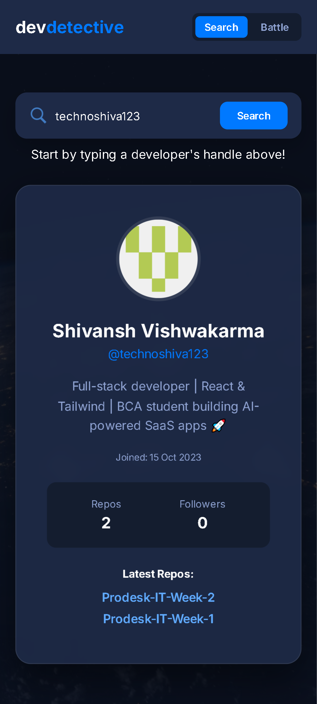
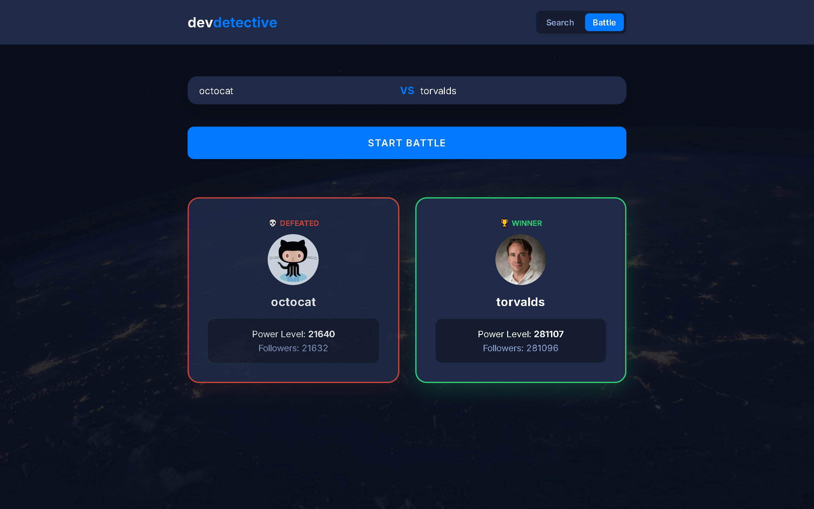

# 🕵️‍♂️ Dev-Detective | GitHub Battle Edition
A high-performance GitHub profiling tool with real-time data visualization and competitive "Battle Mode" logic.

## 📸 Preview

## 🚀 Features
- 🔍 **Real-time Discovery:** Instant GitHub user fetching via REST API with detailed profile metrics.
- 📊 **Repository Analytics:** Dynamic rendering of the top 5 latest repositories with direct navigation links.
- ⚔️ **Advanced Battle Logic:** Simultaneous data fetching for two users to compare "Power Levels" based on followers and public repos.
- 🌌 **Immersive UI:** Modern dark universe theme featuring glassmorphism cards and responsive layouts.
- 🛡️ **Error Resilience:** Robust 404 handling and custom loading states to ensure a seamless user experience.

## 🛠️ Tech Stack
- 💻 **Core:** HTML5, CSS3 (Advanced Flex/Grid), Vanilla JavaScript (ES6+).
- 🏗️ **Architecture:** Async/Await pattern for concurrent API handling.
- 🌐 **APIs:** GitHub REST API for developer data.
- 🎨 **Design:** Inter Font Family, Glassmorphism CSS, and Dynamic Theme Overlays.

## 📂 Project Structure
- `index.html` — Application Layout
- `style.css` — Modern UI & Universe Theme
- `script.js` — Core Logic & API Integration
- `Prompts.md` — AI Workflow Documentation
